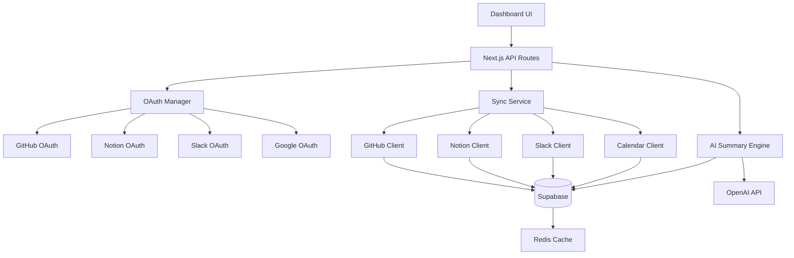

# Design Document: AI-Powered Integrations

## Overview

This feature extends DevTrack's integration capabilities by adding support for Notion, Slack, and Google Calendar alongside the existing GitHub integration. It introduces an AI-powered summary engine that analyzes activity across all connected platforms to provide intelligent insights about user productivity patterns.

The system uses OAuth 2.0 for authentication, implements secure token storage with encryption, and provides automatic background syncing with health monitoring. The AI summary engine leverages OpenAI's GPT models to generate natural language summaries that help users understand their work patterns without manual data analysis.

## Architecture

### High-Level Architecture



### Data Flow

1. **OAuth Flow**: User initiates connection → Redirect to provider → Callback with code → Exchange for tokens → Store encrypted tokens
2. **Sync Flow**: Scheduled job triggers → Fetch data from provider → Transform and validate → Store in database → Update sync status
3. **AI Summary Flow**: User requests summary → Fetch activity data → Send to OpenAI → Parse response → Cache and return summary

## Components and Interfaces

### 1. OAuth Manager (`src/lib/integrations/oauth-manager.ts`)

Handles OAuth 2.0 flows for all providers.

```typescript
interface OAuthConfig {
  clientId: string;
  clientSecret: string;
  redirectUri: string;
  scopes: string[];
  authUrl: string;
  tokenUrl: string;
}

interface OAuthTokens {
  accessToken: string;
  refreshToken?: string;
  expiresAt: Date;
  scope: string;
}

class OAuthManager {
  // Generate authorization URL for provider
  getAuthorizationUrl(provider: IntegrationProvider): string;
  
  // Exchange authorization code for tokens
  exchangeCodeForTokens(provider: IntegrationProvider, code: string): Promise<OAuthTokens>;
  
  // Refresh expired access token
  refreshAccessToken(provider: IntegrationProvider, refreshToken: string): Promise<OAuthTokens>;
  
  // Revoke access token
  revokeToken(provider: IntegrationProvider, token: string): Promise<void>;
}
```

### 2. Token Manager (`src/lib/integrations/token-manager.ts`)

Manages secure storage and retrieval of OAuth tokens.

```typescript
interface StoredToken {
  userId: string;
  provider: IntegrationProvider;
  accessToken: string;
  refreshToken?: string;
  expiresAt: Date;
  encryptedAt: Date;
}

class TokenManager {
  // Store encrypted token
  async storeToken(userId: string, provider: IntegrationProvider, tokens: OAuthTokens): Promise<void>;
  
  // Retrieve and decrypt token
  async getToken(userId: string, provider: IntegrationProvider): Promise<OAuthTokens | null>;
  
  // Check if token is expired and refresh if needed
  async getValidToken(userId: string, provider: IntegrationProvider): Promise<string>;
  
  // Delete token
  async deleteToken(userId: string, provider: IntegrationProvider): Promise<void>;
}
```

### 3. Integration Clients

#### GitHub Client (`src/lib/integrations/github-client.ts`)
Already exists - enhance with additional methods.

```typescript
class GitHubClient {
  async getCommits(since?: Date): Promise<GitHubCommit[]>;
  async getPullRequests(since?: Date): Promise<GitHubPullRequest[]>;
  async getIssues(since?: Date): Promise<GitHubIssue[]>;
  async getRepositories(): Promise<GitHubRepository[]>;
}
```

#### Notion Client (`src/lib/integrations/notion-client.ts`)

```typescript
interface NotionPage {
  id: string;
  title: string;
  lastEditedTime: Date;
  url: string;
  parentDatabase?: string;
}

class NotionClient {
  constructor(token: string);
  
  async getRecentPages(since?: Date): Promise<NotionPage[]>;
  async getDatabases(): Promise<NotionDatabase[]>;
  async getPageContent(pageId: string): Promise<string>;
}
```

#### Slack Client (`src/lib/integrations/slack-client.ts`)

```typescript
interface SlackActivity {
  messageCount: number;
  channelParticipation: Array<{
    channelId: string;
    channelName: string;
    messageCount: number;
  }>;
  dmCount: number;
  reactionsGiven: number;
}

class SlackClient {
  constructor(token: string);
  
  async getUserActivity(since?: Date): Promise<SlackActivity>;
  async getChannels(): Promise<SlackChannel[]>;
  async getTeamInfo(): Promise<SlackTeam>;
}
```

#### Google Calendar Client (`src/lib/integrations/calendar-client.ts`)

```typescript
interface CalendarEvent {
  id: string;
  title: string;
  start: Date;
  end: Date;
  duration: number; // minutes
  attendeeCount: number;
  isOrganizer: boolean;
}

class CalendarClient {
  constructor(token: string);
  
  async getEvents(since?: Date, until?: Date): Promise<CalendarEvent[]>;
  async getCalendars(): Promise<Calendar[]>;
  async getMeetingStats(since?: Date): Promise<MeetingStats>;
}
```

### 4. Sync Service (`src/lib/integrations/sync-service.ts`)

Orchestrates data synchronization from all providers.

```typescript
interface SyncResult {
  provider: IntegrationProvider;
  success: boolean;
  itemsSynced: number;
  error?: string;
  duration: number;
}

class SyncService {
  // Sync single provider
  async syncProvider(userId: string, provider: IntegrationProvider): Promise<SyncResult>;
  
  // Sync all connected providers for user
  async syncAllProviders(userId: string): Promise<SyncResult[]>;
  
  // Schedule background sync
  async scheduleSync(userId: string, provider: IntegrationProvider): Promise<void>;
  
  // Get sync status
  async getSyncStatus(userId: string, provider: IntegrationProvider): Promise<SyncStatus>;
}
```

### 5. AI Summary Engine (`src/lib/integrations/ai-summary-engine.ts`)

Generates intelligent summaries using OpenAI.

```typescript
interface ActivityContext {
  commits: GitHubCommit[];
  pullRequests: GitHubPullRequest[];
  notionPages: NotionPage[];
  slackActivity: SlackActivity;
  calendarEvents: CalendarEvent[];
  dateRange: { start: Date; end: Date };
}

interface AISummary {
  summary: string;
  highlights: string[];
  insights: string[];
  recommendations: string[];
  stats: {
    totalCommits: number;
    totalPRs: number;
    totalMeetings: number;
    meetingHours: number;
    focusTime: number;
    collaborationScore: number;
  };
}

class AISummaryEngine {
  // Generate summary for date range
  async generateSummary(userId: string, dateRange: DateRange): Promise<AISummary>;
  
  // Generate daily summary
  async generateDailySummary(userId: string): Promise<AISummary>;
  
  // Generate weekly summary
  async generateWeeklySummary(userId: string): Promise<AISummary>;
  
  // Get cached summary
  async getCachedSummary(userId: string, date: Date): Promise<AISummary | null>;
}
```

### 6. API Routes

#### `/api/integrations/[provider]/connect` (GET)
Initiates OAuth flow for provider.

#### `/api/integrations/[provider]/callback` (GET)
Handles OAuth callback and token exchange.

#### `/api/integrations/[provider]/disconnect` (POST)
Disconnects integration and revokes tokens.

#### `/api/integrations/[provider]/sync` (POST)
Manually triggers sync for provider.

#### `/api/integrations/[provider]/status` (GET)
Returns sync status and last sync time.

#### `/api/integrations/summary` (GET)
Returns AI-generated summary for specified date range.

Query params: `start`, `end`, `type` (daily/weekly/monthly)

### 7. UI Components

#### IntegrationsPage (`src/app/dashboard/integrations/page.tsx`)
Main integrations management page showing all providers.

```typescript
// Features:
// - List of all integration providers with connection status
// - Connect/Disconnect buttons
// - Last sync timestamp
// - Manual sync button
// - Activity statistics per integration
```

#### IntegrationCard (`src/components/integrations/IntegrationCard.tsx`)
Card component for each integration provider.

```typescript
interface IntegrationCardProps {
  provider: IntegrationProvider;
  connected: boolean;
  lastSync?: Date;
  activityCount: number;
  onConnect: () => void;
  onDisconnect: () => void;
  onSync: () => void;
}
```

#### AISummaryCard (`src/components/integrations/AISummaryCard.tsx`)
Already exists - enhance to show multi-platform summaries.

```typescript
// Enhanced features:
// - Show activity breakdown by platform
// - Display key insights and recommendations
// - Show productivity metrics
// - Date range selector
// - Refresh button
```

#### SyncStatusIndicator (`src/components/integrations/SyncStatusIndicator.tsx`)
Shows real-time sync status.

```typescript
interface SyncStatusProps {
  provider: IntegrationProvider;
  status: 'idle' | 'syncing' | 'success' | 'error';
  lastSync?: Date;
  error?: string;
}
```

## Data Models

### Database Schema Updates

#### integrations table (existing - add fields)
```sql
ALTER TABLE integrations ADD COLUMN IF NOT EXISTS notion_token_encrypted TEXT;
ALTER TABLE integrations ADD COLUMN IF NOT EXISTS notion_refresh_token_encrypted TEXT;
ALTER TABLE integrations ADD COLUMN IF NOT EXISTS notion_token_expires_at TIMESTAMP;

ALTER TABLE integrations ADD COLUMN IF NOT EXISTS slack_token_encrypted TEXT;
ALTER TABLE integrations ADD COLUMN IF NOT EXISTS slack_refresh_token_encrypted TEXT;
ALTER TABLE integrations ADD COLUMN IF NOT EXISTS slack_token_expires_at TIMESTAMP;
ALTER TABLE integrations ADD COLUMN IF NOT EXISTS slack_team_id TEXT;

ALTER TABLE integrations ADD COLUMN IF NOT EXISTS calendar_token_encrypted TEXT;
ALTER TABLE integrations ADD COLUMN IF NOT EXISTS calendar_refresh_token_encrypted TEXT;
ALTER TABLE integrations ADD COLUMN IF NOT EXISTS calendar_token_expires_at TIMESTAMP;

ALTER TABLE integrations ADD COLUMN IF NOT EXISTS last_github_sync TIMESTAMP;
ALTER TABLE integrations ADD COLUMN IF NOT EXISTS last_notion_sync TIMESTAMP;
ALTER TABLE integrations ADD COLUMN IF NOT EXISTS last_slack_sync TIMESTAMP;
ALTER TABLE integrations ADD COLUMN IF NOT EXISTS last_calendar_sync TIMESTAMP;
```

#### integration_sync_logs table (new)
```sql
CREATE TABLE integration_sync_logs (
  id UUID PRIMARY KEY DEFAULT uuid_generate_v4(),
  user_id UUID NOT NULL REFERENCES users(id) ON DELETE CASCADE,
  provider TEXT NOT NULL,
  status TEXT NOT NULL, -- 'success', 'failed', 'partial'
  items_synced INTEGER DEFAULT 0,
  error_message TEXT,
  duration_ms INTEGER,
  started_at TIMESTAMP NOT NULL,
  completed_at TIMESTAMP,
  created_at TIMESTAMP DEFAULT NOW()
);

CREATE INDEX idx_sync_logs_user_provider ON integration_sync_logs(user_id, provider);
CREATE INDEX idx_sync_logs_created_at ON integration_sync_logs(created_at DESC);
```

#### ai_summaries table (new)
```sql
CREATE TABLE ai_summaries (
  id UUID PRIMARY KEY DEFAULT uuid_generate_v4(),
  user_id UUID NOT NULL REFERENCES users(id) ON DELETE CASCADE,
  date DATE NOT NULL,
  type TEXT NOT NULL, -- 'daily', 'weekly', 'monthly'
  summary TEXT NOT NULL,
  highlights JSONB,
  insights JSONB,
  recommendations JSONB,
  stats JSONB,
  created_at TIMESTAMP DEFAULT NOW(),
  UNIQUE(user_id, date, type)
);

CREATE INDEX idx_summaries_user_date ON ai_summaries(user_id, date DESC);
```

#### activities table (enhance existing)
```sql
ALTER TABLE activities ADD COLUMN IF NOT EXISTS source TEXT; -- 'github', 'notion', 'slack', 'calendar'
ALTER TABLE activities ADD COLUMN IF NOT EXISTS external_id TEXT;
ALTER TABLE activities ADD COLUMN IF NOT EXISTS external_url TEXT;

CREATE INDEX idx_activities_source ON activities(source);
CREATE INDEX idx_activities_external_id ON activities(external_id);
```

### TypeScript Types

```typescript
type IntegrationProvider = 'github' | 'notion' | 'slack' | 'calendar';

interface Integration {
  id: string;
  userId: string;
  githubConnected: boolean;
  notionConnected: boolean;
  slackConnected: boolean;
  calendarConnected: boolean;
  lastGithubSync?: Date;
  lastNotionSync?: Date;
  lastSlackSync?: Date;
  lastCalendarSync?: Date;
  createdAt: Date;
  updatedAt: Date;
}

interface SyncLog {
  id: string;
  userId: string;
  provider: IntegrationProvider;
  status: 'success' | 'failed' | 'partial';
  itemsSynced: number;
  errorMessage?: string;
  durationMs: number;
  startedAt: Date;
  completedAt?: Date;
}

interface AISummaryRecord {
  id: string;
  userId: string;
  date: Date;
  type: 'daily' | 'weekly' | 'monthly';
  summary: string;
  highlights: string[];
  insights: string[];
  recommendations: string[];
  stats: Record<string, any>;
  createdAt: Date;
}
```

## Error Handling

### Error Types

```typescript
class IntegrationError extends Error {
  constructor(
    message: string,
    public provider: IntegrationProvider,
    public code: string,
    public retryable: boolean = false
  ) {
    super(message);
  }
}

class OAuthError extends IntegrationError {}
class SyncError extends IntegrationError {}
class RateLimitError extends IntegrationError {}
class TokenExpiredError extends IntegrationError {}
```

### Error Recovery Strategies

1. **Token Expired**: Automatically refresh using refresh token
2. **Rate Limit**: Implement exponential backoff (1min, 5min, 15min, 1hr)
3. **Network Error**: Retry up to 3 times with exponential backoff
4. **Invalid Token**: Mark connection as requiring reauthorization, notify user
5. **Provider Downtime**: Log error, skip sync, retry on next scheduled sync

### User Notifications

- Connection requires reauthorization: Show warning banner on integrations page
- Sync failed 3+ times: Send in-app notification with reconnect link
- Rate limit reached: Show info message with next sync time
- Sync successful: Update last sync timestamp (no notification)

## Testing Strategy

### Unit Tests

1. **OAuth Manager**: Test authorization URL generation, token exchange, refresh logic
2. **Token Manager**: Test encryption/decryption, token storage/retrieval
3. **Integration Clients**: Mock API responses, test data transformation
4. **Sync Service**: Test sync orchestration, error handling, retry logic
5. **AI Summary Engine**: Mock OpenAI responses, test summary generation

### Integration Tests

1. **OAuth Flow**: Test complete OAuth flow with mock provider
2. **Sync Flow**: Test end-to-end sync with mock data
3. **API Routes**: Test all integration endpoints with authenticated requests
4. **Error Scenarios**: Test token expiration, rate limiting, network failures

### Manual Testing Checklist

- [ ] Connect each provider (GitHub, Notion, Slack, Google Calendar)
- [ ] Verify tokens are stored encrypted
- [ ] Trigger manual sync for each provider
- [ ] Verify data appears in activities feed
- [ ] Generate AI summary with multiple integrations
- [ ] Disconnect integration and verify token revocation
- [ ] Test token refresh on expiration
- [ ] Test rate limit handling
- [ ] Test error notifications
- [ ] Verify sync logs are created

## Security Considerations

1. **Token Encryption**: Use AES-256-GCM for token encryption with unique keys per user
2. **Token Storage**: Store encrypted tokens in database, never in logs or client-side
3. **HTTPS Only**: All OAuth redirects and API calls use HTTPS
4. **CSRF Protection**: Implement state parameter in OAuth flow
5. **Scope Minimization**: Request only necessary OAuth scopes
6. **Token Rotation**: Refresh tokens regularly, revoke on disconnect
7. **Rate Limiting**: Implement rate limits on sync endpoints (10 req/min per user)
8. **Audit Logging**: Log all integration connections, disconnections, and sync operations
9. **Data Retention**: Delete integration data when user disconnects or deletes account
10. **API Key Security**: Store provider credentials in environment variables, never in code

## Performance Considerations

1. **Caching**: Cache AI summaries for 1 hour, integration status for 5 minutes
2. **Background Jobs**: Use cron jobs for scheduled syncs, not blocking API calls
3. **Batch Processing**: Fetch data in batches to avoid memory issues
4. **Pagination**: Implement pagination for large datasets (commits, events)
5. **Database Indexing**: Index frequently queried fields (user_id, provider, date)
6. **Connection Pooling**: Reuse HTTP connections for API calls
7. **Lazy Loading**: Load integration data on-demand, not on page load
8. **Debouncing**: Debounce manual sync button to prevent spam

## Deployment Considerations

1. **Environment Variables**: Add OAuth credentials for all providers
2. **Database Migration**: Run migration to add new tables and columns
3. **Cron Jobs**: Set up scheduled sync jobs (every 15-30 minutes)
4. **Monitoring**: Add Sentry tracking for integration errors
5. **Feature Flag**: Deploy behind feature flag for gradual rollout
6. **Documentation**: Update API docs and user guides
7. **Rollback Plan**: Ability to disable integrations without data loss
